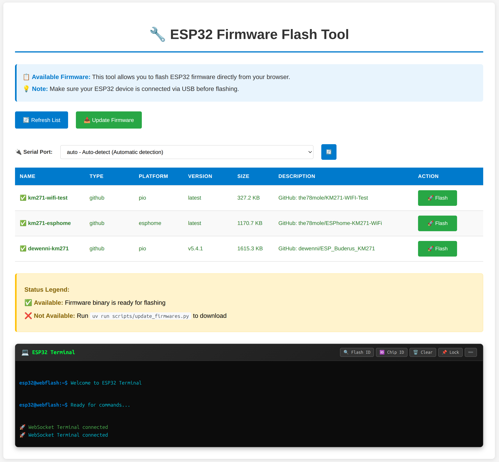
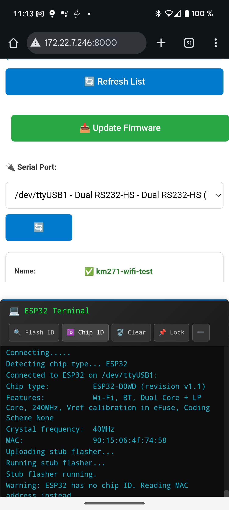

# WebUIFlasher
This project aims to provide a Web service to flash connected targets with different firmware, e.g. for small series production

## Screenshots

### Desktop Interface

*Web interface on desktop showing firmware list and flashing controls*

### Mobile Interface
<div align="center">
  

  
</div>

*Mobile-responsive interface with main firmware view (left) and terminal output (right)*

## Web Interface Features

The WebUIFlasher provides a user-friendly web interface for ESP32 firmware flashing:

### 🔧 Firmware Management
- **Automatic firmware discovery** from configured sources (GitHub releases, local builds)
- **Version tracking** with visual status indicators (✅ available, ❌ needs download)
- **One-click flashing** directly from the browser
- **Serial port selection** with auto-detection

### 💻 Interactive Terminal
- **Real-time output** during flashing operations via WebSocket
- **ESPTool integration** with buttons for common operations:
  - `flash-id`: Read SPI flash memory information
  - `chip-id`: Display ESP32 chip identification
- **Auto-scroll** and manual scroll lock options
- **Clear terminal** and expand/collapse functionality

### 📱 Mobile-Responsive Design
- **Touch-friendly interface** optimized for mobile devices
- **Responsive layout** that adapts to different screen sizes
- **Full functionality** on smartphones and tablets

### 🚀 Getting Started
1. Run the setup script: `./setup-dev.sh`
2. Download firmware: `uv run scripts/update_firmwares.py --sources=sources.yaml`
3. Start web server: `uv run scripts/webflasher.py`
4. Open browser: `http://localhost:8000`

### 🔌 API Access
The WebUIFlasher also provides a REST API for programmatic access:

- **Interactive API Documentation**: `http://localhost:8000/docs` (Swagger UI)
- **Alternative API Docs**: `http://localhost:8000/redoc` (ReDoc)
- **OpenAPI Schema**: `http://localhost:8000/openapi.json`

**Available Endpoints:**
- `GET /api/firmware` - List available firmware
- `GET /api/serial-ports` - List available serial ports
- `POST /api/flash` - Flash firmware to device
- `WebSocket /ws/terminal` - Real-time terminal output

This allows integration with CI/CD pipelines, automated testing, or custom applications.

## 🐳 Docker Deployment

WebUIFlasher provides two Docker deployment options for different security requirements.

### Quick Start with Docker

**Option 1: Standard Setup (Recommended)**
```bash
# Clone repository and build locally
git clone https://github.com/the78mole/WebUIFlasher.git
cd WebUIFlasher
make up
```

**Option 2: Use Pre-built Image**
```bash
# Download and run latest release
docker run -d \
  --name webui-flasher \
  --privileged \
  -p 8000:8000 \
  -v /dev:/dev \
  ghcr.io/the78mole/webuiflasher:latest
```

### Docker Compose Configurations

**Standard Setup (`docker-compose.yml`)**
- **Full USB access** with `/dev` mount
- **Privileged mode** for maximum hardware compatibility
- **Recommended for development and ease of use**

**Secure Setup (`docker-compose.selected-tty.yaml`)**
- **Selected USB devices only** (ttyUSB*, ttyACM*)
- **Non-privileged mode** for production environments
- **Better security isolation**

### Available Commands

```bash
make help          # Show all available commands
make up            # Start standard setup (full USB access)
make secure        # Start secure setup (selected devices only)
make down          # Stop the service
make secure-down   # Stop secure service
make logs          # Show service logs
make build         # Build Docker image locally
```

### Docker Images

**GitHub Container Registry:**
- Latest: `ghcr.io/the78mole/webuiflasher:latest`
- Specific version: `ghcr.io/the78mole/webuiflasher:v1.0.0`

**Supported Platforms:**
- `linux/amd64` (Intel/AMD)
- `linux/arm64` (ARM64/Apple Silicon)

### USB Device Access
The docker-compose.yml maps common USB serial devices:
- `/dev/ttyUSB0`, `/dev/ttyUSB1` - USB-to-serial adapters
- `/dev/ttyACM0`, `/dev/ttyACM1` - Arduino/ESP32 devices

**Custom USB devices:**
```yaml
devices:
  - /dev/ttyUSB2:/dev/ttyUSB2  # Add your specific device
```

### Development Mode
```bash
# Start with development profile (more permissive USB access)
docker-compose --profile dev up -d webflasher-dev
```

### Environment Variables
- `WEBFLASHER_HOST`: Server bind address (default: 0.0.0.0)
- `WEBFLASHER_PORT`: Server port (default: 8000)

## Firmware Development Setup

This directory contains all firmware-related files and scripts for ESP32 device management and flashing.

### Quick Start

1. **Run setup script:**
   ```bash
   ./setup-dev.sh
   ```

2. **Download firmware:**
   ```bash
   uv run scripts/update_firmwares.py --sources=sources.yaml
   ```

### Structure

```
WebUIFlasher/
├── setup-dev.sh              # Local development setup script
├── pyproject.toml             # Python project configuration
├── uv.lock                    # Dependency lock file
├── sources.yaml               # Firmware sources configuration
├── scripts/                   # Python scripts
│   ├── webflasher.py          # Web interface server
│   ├── update_firmwares.py    # Firmware download script
│   ├── flash_firmware.py      # Command-line flashing
│   └── site/                  # Web UI assets (HTML, CSS, JS)
├── tmpfw/                     # Downloaded firmware binaries
└── img/                       # Screenshots and documentation images
```

### Development

#### Python Environment

The project uses `uv` for fast dependency management:

```bash
# Install/update dependencies
uv sync

# Add new dependency
uv add <package-name>

# Run Python scripts
uv run <script-name>
```

#### Firmware Download

Download current firmware releases:

```bash
# Download all configured firmwares
uv run scripts/update_firmwares.py --sources=sources.yaml

# Show only error messages
uv run scripts/update_firmwares.py --sources=sources.yaml --quiet

# Show help
uv run scripts/update_firmwares.py --help
```

### Hardware Access

Unlike container-based solutions, you have direct access to:

- USB ports for ESP32 programming
- Serial interfaces
- Hardware debuggers
- OTA updates over network

### Tools

The following tools are automatically installed:

- **uv**: Fast Python package manager
- **PyGithub**: GitHub API client
- **PlatformIO**: Hardware development platform
- **Development Tools**: black, ruff, pylint, pytest

### Scripts

#### `scripts/update_firmwares.py`
Downloads and builds all firmware images defined in sources.yaml.

```bash
# Download all firmware
uv run scripts/update_firmwares.py

# Quiet mode (no progress bars)
uv run scripts/update_firmwares.py --quiet

# Generate version info for releases
uv run scripts/update_firmwares.py --save-versions

# Custom sources file
uv run scripts/update_firmwares.py --sources=custom.yaml
```

#### `scripts/generate_release_description.py`
Generates GitHub release descriptions from version information.

```bash
# Generate release description from versions.json
uv run scripts/generate_release_description.py

# Custom input/output files
uv run scripts/generate_release_description.py --versions=custom_versions.json --output=release.md
```

#### `scripts/flash_firmware.py`
Flash firmware to ESP32 devices with support for batch production.

```bash
# List available firmware
uv run scripts/flash_firmware.py

# Flash single device
uv run scripts/flash_firmware.py blinkenlights
uv run scripts/flash_firmware.py dewenni-km271 -p /dev/ttyUSB0

# Batch production mode (for multiple devices)
uv run scripts/flash_firmware.py blinkenlights --loop

# Short options
uv run scripts/flash_firmware.py km271-esphome -l -p /dev/ttyUSB1 -b 115200
```

**Batch Production:**
- Flash device → Success message
- Press any key to continue with next device
- Press 'n' or ESC to stop and show statistics

### Troubleshooting

**uv not found:**
```bash
# Install uv if not available
curl -LsSf https://astral.sh/uv/install.sh | sh
# Or via pip
pip install uv
```

**PlatformIO USB access:**
```bash
# Add user to dialout group (Linux)
sudo usermod -a -G dialout $USER
# Then log out and back in
```

**Virtual environment issues:**
```bash
# Recreate venv
rm -rf .venv
uv sync
```
